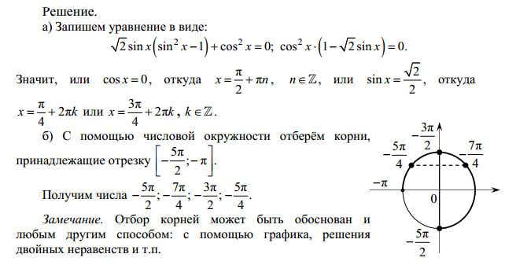

## XOR с решением тригонометрического уравнения

| Событие | Название | Категория | Сложность |
| :------------- | ---------------- | ------------------ | ------------------ |
| VKAKIDS 2024   | Triga in Triga   | Cryptography       | easy               |

### Описание

> Автор: [l1l_w31rd03]

Учительница по математике сказала, что, если я не решу это уравнение, то не сдам ЕГЭ по математике и меня будет ждать свободная касса.

### Решение

Открываем файлы task.py.

- В исходном коде видно, что исходный флаг разбивается на части по знаку "_" и затем подвергается логической операции "исключающее или" с некоторым массивом значений переменной x.
- Видим тригонометрическое уравнение, решаем его:
- 
- пробуем написать функцию decode, используя корни уравнения на заданном промежутке и Ciphertext:

```python
ciphertext: [-27991888597626588, -1836410371, -1802379795, -1832155965]

def decode(ciphertext, x):
    original_parts = []
    for ctext, key in zip(ciphertext, x):
        key_int = int(key * 1000)
        original_long = ctext ^ key_int
        original_bytes = long_to_bytes(original_long)
        original_parts.append(original_bytes.decode())
    return original_parts

x = [-7.85, -5.495, -4.71, -3.925] 

decoded_parts = decode(ciphertext, x)
print("Decoded Parts:", decoded_parts) 
```

Получаем флаг и добавляя "_", оборачиваем его в формат vka{flag}

### Флаг

```
vka{crypt0r_must_kn0w_m4th}
```
