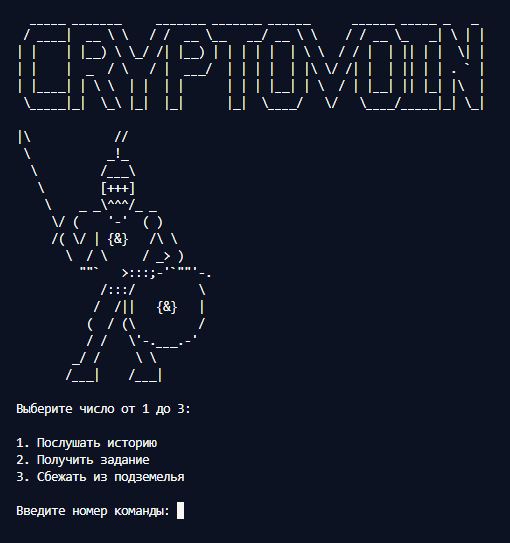
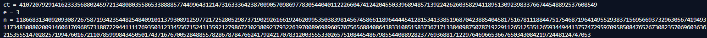
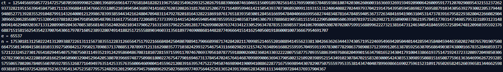
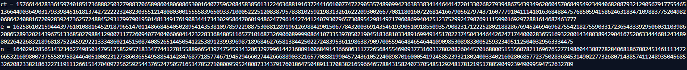

## Решение криптосистемы RSA на различные виды атак

| Событие | Название | Категория | Сложность |
| :------------- | ---------------- | ------------------ | ------------------ |
| VKAKIDS 2024   | CryptoVoin       | crypto             | hard               |

### Описание

> Автор: [l1l_w31rd03]

В мрачных подземельях скитался криптовоин, в поисках легендарного флага, который даровал власть над всеми криптоалгоритмами...

### Решение

Подключаемся по nc к сервису и видим :



Выбираем 2:

- Получаем первые значения `ct, n, e`



Можем заметить, что, в данном случае используется малое значение открытого ключа `e`, что является уязвимостью криптосистемы RSA.  Опишем атаку на малую открытую экспоненту:

```python
import gmpy2
from Crypto.Util.number import long_to_bytes

ct = 410720792914162333568802459721348080355865338888577449964312147316333642387009057098697783054404011222660474124204550339689485713922426260358294118951309239833766744548892537608549
e = 3
n = 11866831340920930872675871934235448254840910113793089125977217252805298737190292616619246209953503839814567458661189644445412815341338519687042388540458175167811188447517546871964149552938371569566937329630567419493117348308802009146061769685731887229441111769350312334556715243135921279867230238092379322639700896989605707565688408643833108515837367171338409875078719229112651253512659344944137574729597095850847652673082357069603636215355514702825719947601672110785999843450501743716767005284885578286787847662417924217078312003555330265751084454867985544088928237769368817122976469665366765034308421972448124747053


if ct < gmpy2.iroot(n, 3)[0]:
    m = gmpy2.iroot(ct, 3)[0]
    m = long_to_bytes(m)
    print(f"Расшифрованное сообщение: {m}")
else:
    print("Условие для атаки Гастада не выполнено.")
```

Проверяем и, действительно получаем: `vka{f1rst_l0ck_1s_0p3n3d}`

- Получаем вторую тройку значений `ct, n, e`

  

Видим, что ct и n имеют длину в 1024 символа. Также обратим внимание на упоминание Ферма. Вспомним, кто это: Пьер де Ферма - французский математик-самоучка, один из создателей аналитической геометрии, математического анализа, теории вероятностей и теории чисел, также примечательно, что он предложил один из методов [факторизации чисел](https://ru.wikipedia.org/wiki/%D0%9C%D0%B5%D1%82%D0%BE%D0%B4_%D1%84%D0%B0%D0%BA%D1%82%D0%BE%D1%80%D0%B8%D0%B7%D0%B0%D1%86%D0%B8%D0%B8_%D0%A4%D0%B5%D1%80%D0%BC%D0%B0), попробуем описать его и применить для декодирования сообщения:

```python
import math
from Crypto.Util.number import long_to_bytes, inverse

ct = 125445669505772147257507059699990252801396895696147776581841828211967550235496299325202679188390660746104651560918970256145176959090378485938618074203062606003163669326915949209006426009591771207029089543215123726293732821951563964584750171116396884183476663551805210349450436897414168276203208263181768325206771716489599461421505439370730689209913193151312406408827024497937042191476439505945869827369588791034305639279300220537944894085277139283552910487991143264000121299867839938594434216248047094831147927820181643282218691076176518393503001284561669947840406666995682744834878164784859405367372634841694190631045314737839167958229382804226608290430966520628568071532064197881022047910502054870631661775610172206891737339931441542464594054907855959224035871045306793788868190558115156122905800056063910781971526298271355090903786219578451770314734985795323189312314804941462940920367133120899092043670853856814635624026821034379062716315693796225201281774269980207637433412330529634787835336985973641067098092087070280759915688996222732138164731246340541846595572589474812096039559237668871515815625435423700764306179707160523893280749141882517255588903460331356189774690086814482877496664151416254056019186000100736667954691707
e = 65537
n = 175301813125022241312093887226131115673835512283126656475179221666848425048070894179066899871742842021170998521465520108894145562338130426636263444374305719522469549694205044014428594358404594463502027487657019075086647550134984158618103339275098421279502178908371370885170789971213162980357771038242993275467543116602982932157427634896168825595957049591199783007782986379890837123999120513878592563070568649030743800166783528468593735721223245273017654102944540757987560311493521912429586048670831810728159715991170746706937056107877591880026002360243303222280755877570935588639497686820499015634798165234304179100433866193751471924372332089720498503066278239036342228010581662594509003290452964205380703966974877509861800227675477901694673137845470245764146870998990063694379058023210920398952154349102307847021583203000542430353309893508815165087759613636469962672932855755065780206784055607059278553268771649497635142533576356006460900414559621208391639574752279450746989041900941088622877167596989443078290750755597953353814347404078996986616902759615231091765026582452603965813446625986938103744597254289876236374541347523587795752482912012905679457600896292502768699774975644252613652439139865283420111134489972844376937904367

def is_perfect_square(x):
    """Проверяет, является ли x полным квадратом."""
    s = int(math.isqrt(x))
    return s * s == x

def fermat_factorization(n):
    """Факторизация числа n с помощью метода Ферма."""
    a = math.isqrt(n) + 1 
    while True:
        b2 = a * a - n 
        if is_perfect_square(b2):
            b = int(math.isqrt(b2))
            p = a - b
            q = a + b
            return p, q 
        a += 1 

p, q = fermat_factorization(n)
phi = (p - 1) * (q - 1)
d = inverse(e, phi)
m = pow(ct, d, n)
m = long_to_bytes(m)
print(f'Расшифрованное сообщение:{m}')
```

Получаем заслуженный флаг от второго замка: `vka{s3c0nd_l0ck_1s_d0wn}`

- Наконец-таки получаем последнюю тройку `ct, n, e`

Анализируя полученные значения, видим, что n, e имеют равную длину и притом достаточно большую. Также в задании упомянута фамилия ученого [Майкла Дж. Винера](https://ru.wikipedia.org/wiki/%D0%90%D1%82%D0%B0%D0%BA%D0%B0_%D0%92%D0%B8%D0%BD%D0%B5%D1%80%D0%B0), смотрим и определяем можно-ли ее использовать: Поскольку e велико, возможно, можно было бы легко найти d, это чрезмерное упрощение, но e и d часто могут иметь обратную зависимость от их длины, когда один относительно мал, а другой относительно велик. Опишем атаку с использованием библиотеки owinier:

```python
import owiener
from Crypto.Util.number importlong_to_bytes
ct = 15766144283361597401851736888250327988370658986048060865300164077596208458385613122463688191637244166100774722905357489099423638338341446441472013302682793948675439349620604570684954923494068208793212905679177554651366449036490317933984516181374272222232482303551214808030015555839650933710005222512083879578381025921983132616222093002667708118016072268141667905627974371607779104111410163684884757685059415862463183471098837752049820686424088167209283924736257248845293179979019501481349176190834417343029586470601948624779614427441240793079657308954298149717960869940425123752992479876911159901692972881614687463777
e = 16258610215944439761010881645291879651470114866845405028954143538109785922988753088128919612698842901506778432003691435461939051091855093579082317122252802188286769452469469627554218275590331723654333929506031103986208652893202143967513368502798841290071177260940774040606041423228336848051165771016873269060899990864107335397050219045183681033489169949145170223745043446442624717440002836551693220014348038942904167520633444681243489802264226832189681875224592922133348602145150874085265144505412253891239939698718968462765813844250227248395361198638790970055946484654644109098530898330052593234951125040329563334475
n = 16402912856514323462749850147951758529571833477441278155889665439747545934328632979961442168891006849143666863117726568455469093773160337802082604457016880051535607821169676527719860443887782840681867882451461113472665321609800737555899582446405100823127386036554958854142847687718577467194529466027442666889033216577088819904572436105224089870160005419245852393218024003340216028068577237502836845314902277326807143857411248935045685326208233821863227119111266151470409725625925443765247505716514785271080095952480873343791760186475048911370838216596646578843158240737054851292481781219517885904923949099594752632789
d = owiener.attack(e, N)
if d:
    print(long_to_bytes(pow(ct, d, N)))
else:
    print('No luck!')
```

Получаем: vka{y0u_br0k3_th3_l457_l0ck}

Флаг

```
vka{w0w_y0ur_r34lly_tru3_crypt0_w4rr10r_g00d_j0b!}
```
