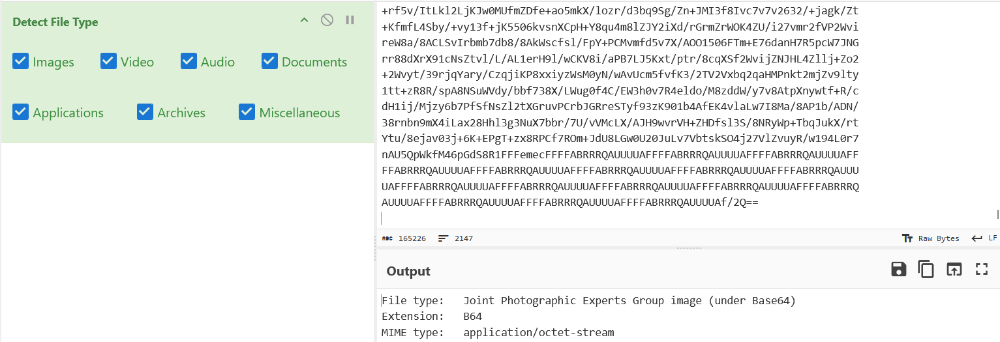
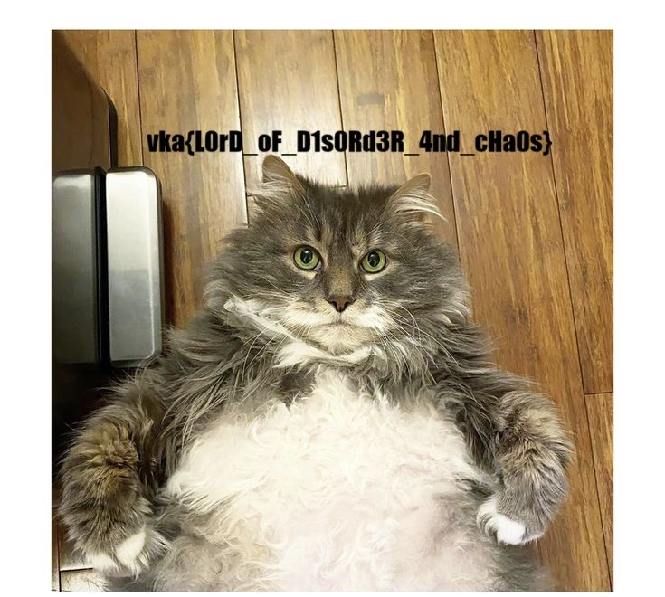

## PPC

| Событие | Название | Категория | Сложность |
| :------ | ---- | ---- | ---- |
| VKAKIDS 2024 | Mess | misc | easy |

  
### Описание

> Автор: [old3gg]
>
Только дурак нуждается в порядке - гений господствует над хаосом

### Решение
- Перед нами простой netcat, раз в полсекунды отправляющий нам строку формата {чиcло} : строка в base64.
- Спустя некоторое время можно заметить, что строки и номера не повторяются достаточно долго и декодирование строк по отдельности ни к чему осмысленному не приводит => можем предположить, что нужно собрать их вместе, а число перед ":" возьмём в качестве индекса.
- Будем собирать до тех пор, пока числа и строки не начнут повторятся.
[Скрипт для сбора и конкатенации всех строк](./solve.py)
- В итоге мы получим довольно большой base64, посмотрим, что скажет на это любимый [CyberChef](https://gchq.github.io/CyberChef/)
Magic подсказывает нам 

- Далее, недолго думая, там же делаем From Base64 и рендерим картинку

### Флаг

