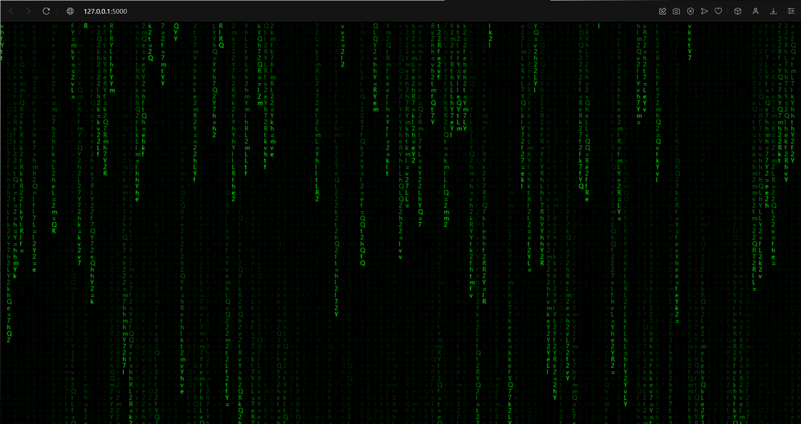

## Парсер с декодированием base64

| Событие | Название | Категория | Сложность |
| :------------- | ---------------- | ------------------ | ------------------ |
| VKAKIDS 2024   | Flagопад     | misc               | meduim             |

### Описание

> Автор: [l1l_w31rd03]

Ты только посмотри на это. Это же настоящий флагопад!

### Решение

Заходим на сайт и видим:



По буквам пролетают строки base64, скопировать не получается. Попытаемся посмотреть, что происходит в панели разработчика:

- Немного поискав, перейдем в `<console>` и увидим сообщение:

  

- По виду закодированного сообщения ясно, что это `base64`. Воспользуемся для декодирования `Python`:

  

- Попробуем перейти на ручку:

  

  Видим, что в ручке генерируется какая-то строка из `base64`, при обновлении страницы строка изменяется. Исходя их описания, можем предположить, что среди этих строк встречается флаг. Попробуем написать парсер:

  ```python
  #!/bin/python
  import requests
  import time
  import base64
  import sys

  URL = sys.argv[1] if len(sys.argv) > 1 else 'http://127.0.0.1:5000'

  def fetch_generated_string(url):
      while True:
          try:
              response = requests.get(url)
              response.raise_for_status()  
              generated_string = response.text  


              try:
                  decoded_string = base64.b64decode(generated_string).decode('utf-8')
                  if 'vka' in decoded_string:
                      print(f"Найден флаг: {decoded_string}")


              except (base64.binascii.Error, UnicodeDecodeError) as e:
                  print(f'Полученная строка: {base64.b64decode(generated_string)}')

          except requests.RequestException as e:
              print(f"Ошибка при запросе к серверу: {e}")

          time.sleep(0.5) 


  if __name__ == '__main__':
      fetch_generated_string(f'{URL}/dozhd')
  ```

Запускаем и видим:


### Флаг

```
vka{its_raining_flag!}
```
