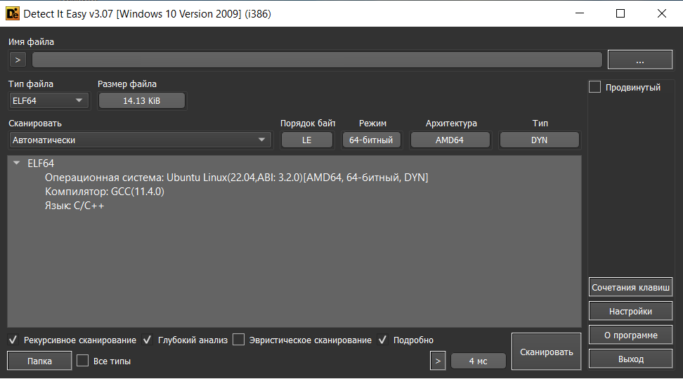
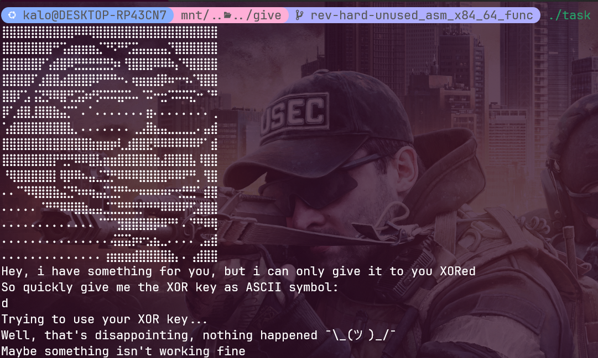
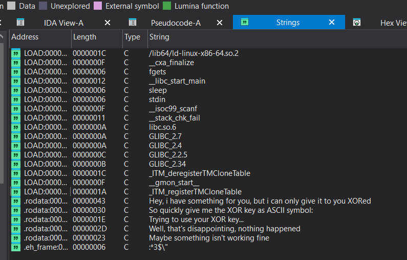
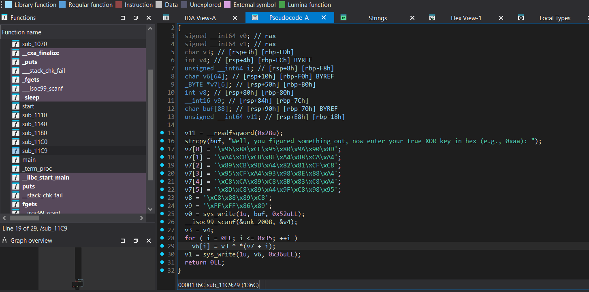

## Неиспользуемая x86_64 Intel Assembler функция в C бинарном файле

| Событие | Название | Категория | Сложность |
| :------ | ---- | ---- | ---- |
| VKAKIDS 2024 | Sneaky | reverse | hard |

  
### Описание


> Автор: [Invis_one]
>
Поговаривают, что в этой программе есть какой-то скрытый функционал. Интересно, что же там спрятано?


### Решение

Участникам выдается `elf 64` исполняемый файл. Сразу же кидаем его в `DiE`



Ничего необычного, попробуем запустить



Вновь ничего полезного. Закидываем в `IDA Pro`, проверяем `strings`



Результат тот же. Попробуем пробежаться по функциям в программе. Натыкаемся на следующее:



Уже интересней. Покапавшись в функции, понимаем, что после вывода сообщения на экран, принимается пользовательский ввод формата `0xaa`, затем над введенным значением и каждый элементом `v7`, `v8` и `v9` происходит операция xor, затем результат выводиться на экран. Можем предположить, что `v7`, `v8` и `v9` это и есть проксоренный флаг. Поэтому достаем его и зная, что xor взаимообратная операция получаем, что если проксорить первые четыре байта с `vka{`, то ключ `0xfb`. 

Пример решения представлен в [solve.py](solve.py)

### Флаг

```
vka{nasm_is_too_eazy_for_such_an_experienced_reverser}
```
