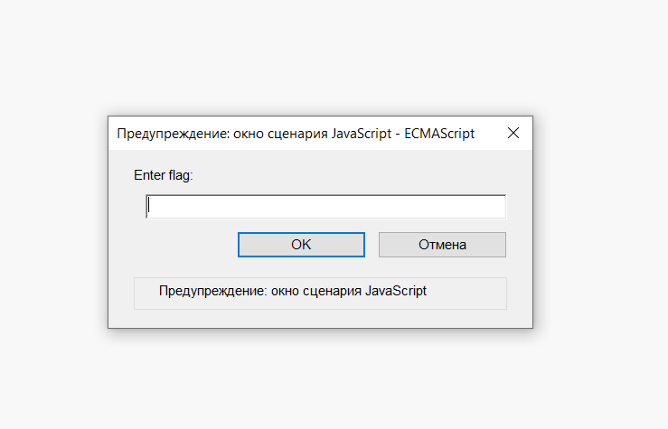
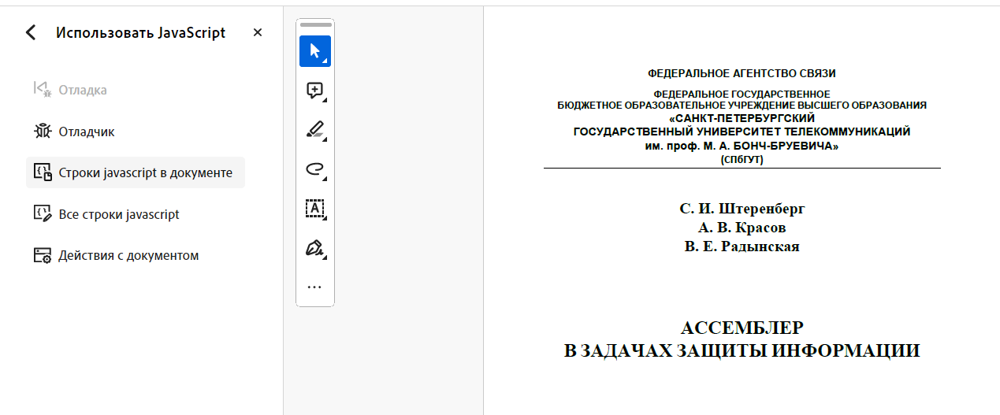
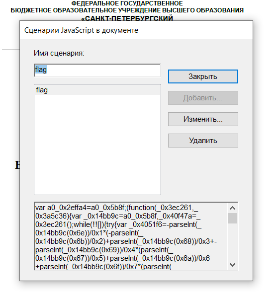

## PDF с исполняемым JS обфусцированным кодом

| Событие | Название | Категория | Сложность |
| :------ | ---- | ---- | ---- |
| VKAKIDS 2024 | PDFScript | reverse | meduim |

  
### Описание


> Автор: [Invis_one]
>
Друг поделился со мной статьей про ассемблер, но каждый раз, когда я ее открываю меня просят что-то ввести. Помоги мне разобраться с этой проблемой.


### Решение
Открывaем предоставленный нам `.pdf` файл. Я буду использовать `Adobe Acrobat Reader Pro`.

Нас сразу же встречает окно с просьбой ввести ему флаг



В нем нам становиться понятно, что использовался сценарий `JavaScript`

Используем встроенные инструменты и идем в `Использовать JavaScript`



Затем, нажимаем `Строки javascript в документе`. И видим...



Явно код [обфусцировали](https://yandex.ru/search/?text=обфускация&lr=146&clid=2456107&noreask=1&nomisspell=1), поэтому копируем его и пробуем воспользоваться любым онлайн деобфускатором, например [Obfuscator.io Deobfuscator](https://obf-io.deobfuscate.io).
Копируем код который был файле, далее на сайте деобфусцируем и получаем следующее:

```javascript
var encrypted = [0x59, 0x44, 0x4e, 0x54, 0x5f, 0x47, 0x1c, 0x58, 0x70, 0x46, 0x5b, 0x5c, 0x70, 0x48, 0x1f, 0x1f, 0x4b, 0x70, 0x5b, 0x47, 0x1b, 0x5b, 0x70, 0x5b, 0x47, 0x1c, 0x5d, 0x1c, 0x70, 0x58, 0x1b, 0x5c, 0x70, 0x41, 0x1f, 0x70, 0x42, 0x1b, 0x43, 0x1e, 0x4c, 0x1e, 0x40, 0x5a, 0x5c, 0x70, 0x4c, 0x1f, 0x4b, 0x1c, 0x52];
function decrypt(_0x321d5b, _0x2b0df3) {
  var _0x39d0da = '';
  for (var _0xb58d75 = 0x0; _0xb58d75 < _0x321d5b.length; _0xb58d75++) {
    _0x39d0da += String.fromCharCode(_0x321d5b[_0xb58d75] ^ _0x2b0df3);
  }
  return _0x39d0da;
}
var correct = decrypt(encrypted, 0x2f);
var input = app.response("Enter flag:");
function checkFlag(_0x1cabfe, _0x59cf5c) {
  if (_0x1cabfe.length !== _0x59cf5c.length) {
    return false;
  }
  for (var _0x4333ed = 0x0; _0x4333ed < _0x59cf5c.length; _0x4333ed++) {
    if (_0x1cabfe[_0x4333ed] !== _0x59cf5c[_0x4333ed]) {
      return false;
    }
  }
  return true;
}
if (checkFlag(input, correct)) {
  app.alert("Correct flag!");
} else {
  app.alert("Incorrect flag.");
}
```

Немного проанализировав код, понимаем, что над введенной пользователем строкой происходит оперция xor с ключом `0x2f`. Все что остается, это проделать обратную операцию xor над `encrypted` с ключом `0x2f`

Пример решения представлен в [ans.py](ans.py)
 
### Флаг

```
vka{phew_its_good_that_there_was_no_malicious_code}
```
