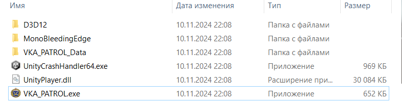
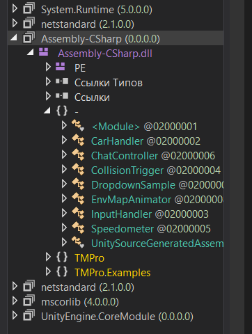
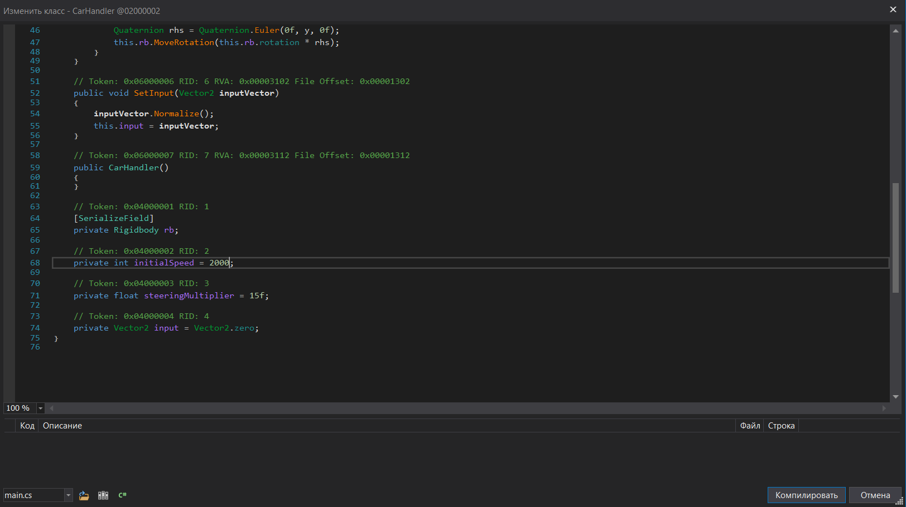

## Speedhack с помощью патча C# байт-кода

| Событие | Название | Категория | Сложность |
| :------ | ---- | ---- | ---- |
| VKAKIDS 2024 | Патрульный | reverse | medium |

  
### Описание


> Автор: [Invis_one]
>
Уже устал патрулировать эту улицу, когда там конец?


### Решение

Участникам выдается архив с игрой. В ней нам предлагают ехать по прямой на улице. Очевидно, что если попробовать ехать при начальных условиях ни к чему это не приведет. Начинаем копать.



По файлам игры становиться ясно, что написана она при помощи `Unity` (об этом же сообщает загрузочный экран). 
Поинтересовавшись у `ChatGPT` `Где хранит игра, написанная на Unity, байт-код исходников?` получим следующее:

```
В играх, написанных на Unity, байт-код исходников обычно хранится в скомпилированных файлах, которые генерируются при сборке проекта. Основные места хранения байт-кода зависят от целевой платформы:

PC (Windows, MacOS, Linux):

    На этих платформах игра собирается в виде исполняемого файла (.exe для Windows) и дополнительных файлов.
    Байт-код C#-скриптов компилируется в сборки .dll, которые находятся в папке Managed внутри каталога Data в папке сборки (например,  MyGame_Data/Managed/). Основные файлы:
        Assembly-CSharp.dll — содержит скомпилированные скрипты, написанные пользователем.
        UnityEngine.dll и другие библиотеки Unity — стандартные библиотеки движка.
```

Отлично, так как наша целевая платформа PC (Windows), то воспользуемся `dnSpy` для реверса байт-кода `Assembly-CSharp.dll`, находящийся по пути `game\VKA_PATROL_Data\Managed`.



Модуль `CarHandler` исходя из названия отвечает за управление нашей патрульной машины. Покапавшишь в коде, найдем переменную `private int initialSpeed` отвечающую за скорость нашей машины. Изменим её с помощью `dnSpy` на любое большое значение, например 2000.



Компилируем, сохраняем модуль. Запускаем игру, теперь мы двигаемся с установленной нами скоростью. Проехав около 20 секунд по прямой мы доезжаем до флага, после чего на экран выводиться сообщение с заветным флажком.

### Флаг

```
vka{e153e96530c14e5c0c1fb8f7d83822fa656a17a7b9460f998e1201a2810443cf}
```
