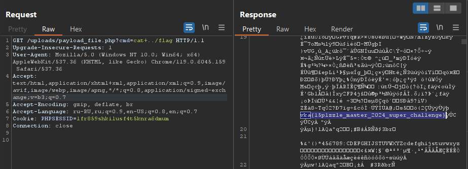
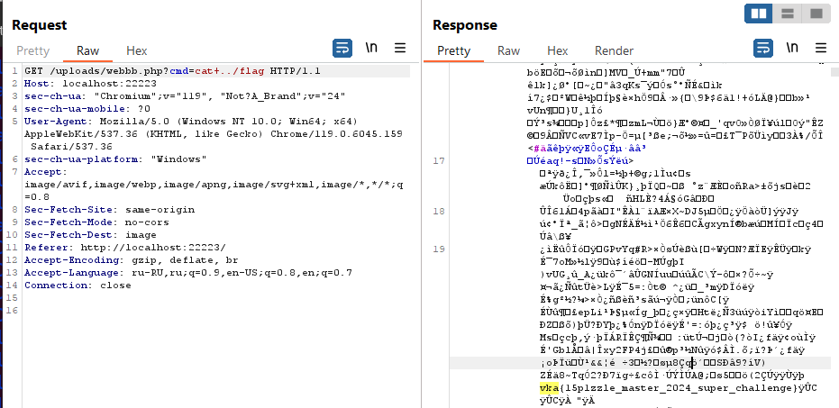

## Собери пазл и загрузи секретное изображение!


| Событие | Название | Категория | Сложность |
| :------ | ---- | ---- | ---- |
| VKAKIDS 2024 | PuzzleMaster | Web | easy |


### Описание


> Автор: [Timur219]
>
Соберите идеальный пазл, двигаясь по клеткам, пока не соберете картину! Challenge yourself с каждым новым изображением!


### Решение
После успешного решения пятнашек активируется кнопка загрузки файлов.
Обратите внимание, что сервер успешно блокирует загрузку файлов, которые не являются изображениями, проходит проверка по MIME-типу и размеру файла.
Создайте файл PHP/JPG, который по сути является обычным изображением, но содержит полезную нагрузку PHP в своих метаданных.

Это можно сделать с помощью exiftool:
```
exiftool -Comment="<?php system($_GET["cmd"]); ?>" your_image.jpg -o payload_file.php
```
Как только файл будет создан, собираем пазл и закидываем файл в форму загрузки и загружаем на сервер.
Используя Burp Suite перехватим GET запрос подгрузки файла и передадим ему команду в параметр cmd:


Находим файл flag/ и смотрим его содержимое:


### Флаг

```
vka{15p1zzle_master_2024_super_challenge}
```


