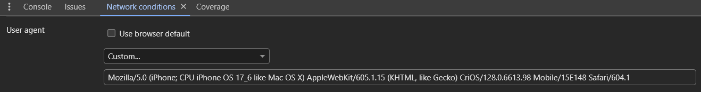
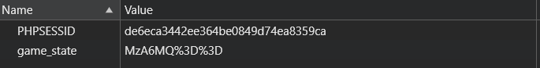
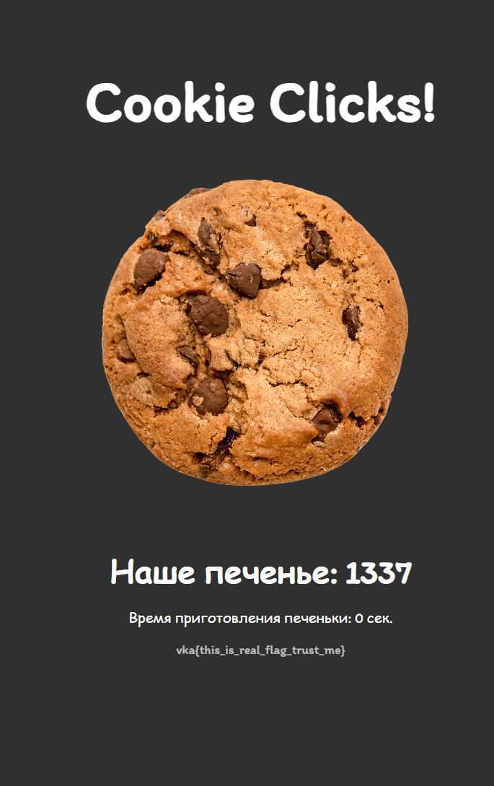

## Натапал печенек...

| Событие | Название | Категория | Сложность |
| :------ | ---- | ---- | ---- |
| VKAKIDS 2024 | Cookie Clicks! | web | easy |

  
### Описание


> Автор: [one!tea]
>
Хомяк - это круто, но только тут мы сможем реально разбогатеть!!! Я уже заработал 1337, давай догоняй!


### Решение
Открываем телеграмм бота через Telegram Desktop или web.telegram.org и переходим в его веб-приложение. Тут же получаем ответ: `Похоже, что вы используете не мобильное устройство!`.

Пробуем зайти с телефона и приложение запускает кликер. То есть оно откуда-то берёт информацию о нашем устройстве. Данные об устройстве и браузере содержаться в user-agent.

Так что устанавливаем любой user-agent мобильного устройства, например `Mozilla/5.0 (iPhone; CPU iPhone OS 17_6 like Mac OS X) AppleWebKit/605.1.15 (KHTML, like Gecko) CriOS/128.0.6613.98 Mobile/15E148 Safari/604.1`.


Отлично! Мы получили доступ. Далее переходим в браузерную версию телеграмма и узнаём, что сам кликер лежит на домене `cookieclicks.vkactf.ru`. Переходим.

Ищем что-нибудь полезное в инструментах разработчика. Бинго, находим cookie файл `game_state`. Очень похожий на base64 код. 


Декодируя, понимаем, что оно представляет из себя `время_изготовления:количество_печенек`. (Можно воспользоваться [CyberChef](https://gchq.github.io/CyberChef/#recipe=From_Base64('A-Za-z0-9%2B/%3D',true,false)))

Пробуем поменять его на `0:количество_печенек`. Кодируем в base64 и меняем значение cookie на сайте.

Теперь у нас нет задержки при нажатии на кнопку. Можно натыкать 1337 печенек вручную, но время нам дорого. Поэтому используем burp suite intruder или python [solution.py](./solution.py).

Как только мы накопили достаточное кол-во, на сайте появляется флаг.


### Флаг

```
vka{tapai_cookie_clicks_criminal}
```
