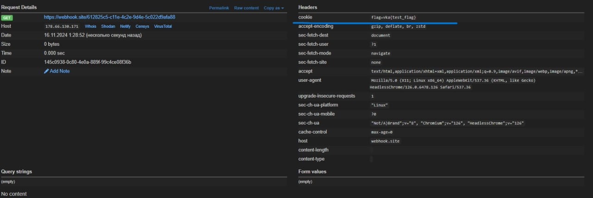

## Медицинское учреждение MEDVKACentre

|   Событие    |   Название   | Категория | Сложность |
| :----------- | ------------ | --------- | --------- |
| VKAKIDS 2024 | MEDVKACentre |    WEB    |   MEDIUM  |

### Описание

> Автор: [[mister_scaletta](https://t.me/mister_scaletta)]
>
> В медицинский центр нашей академии поступает большое количество заявок на запись, из-за чего на их рассмотрение уходит очень много времени. Попробуйте повысить приоритет своей заявки

### Решение

Дан сайт, имитирующий работу обработки и отправки заявок на прием к врачу. Имеется регистрация и авторизация на сайте, общая информация о каждом враче, 
страница профиля, на которой отображаются основные данные о пользователе и все сформированные заявки, и, непосредственно, сама страница формирования и отправки заявлений.
Наличие любого поля ввода является потенциальным уязвимым местом и при недолжном подходе к защите со стороны разработчиков, может возникнуть уязвимость на основе
инъекции кода, а именно:  SQL, XSS, XXE, etc.

- В первую очередь необходимо внимательно посмотреть на исходный код, и на наличие JS скриптов
- В исходном коде видно, что используется черный список для фильтрации от тегов, что не является безопасным решением.    
- Анализируя список тегов и  аттрибутов, мы отмечаем, что не все поддаются санитизации, а именно : img, src, onload, fetch
- Наличие, а точней отсутствие в списке фильтрации, fetch, как минимум, должно натолкнуть нас на мысль перехватить запрос, чтобы посмотреть его заголовок, например через WebHook
- Также следует обратить внимание, что тег onload срабатывает только в случае корректного URL картинки, указанного в src, поэтому необходимо проверить, чтобы она прогружалась и корректно отображалась
- Отправляя полезную нагрузку, указывая Cookie, которые мы будем перехватывать

```
  
```
- Мы получаем наш Request, в котором находится токен авторизации а также Cookie, но в них нет флага.
- Помним, что у нас есть интерактивный bot, который имитирует отправку ссылок. Запускается как из контейнера, так и через netcat
- Для каждой заявки у нас формируется уникальный URL, хранящийся в db, передаем часть URL боту (той сформированной страницы, где прошло применение XSS)

```
/MzQ1My0wNS0yMzIzOjUzY2FyZGlvbG9naXN0
```


### Флаг возвращается на наш вебхук:



### Устранение уязвимости:

Важно отметить, что использование черных списко для фильтрации от различных инъекций является крайне небезопасным решение.
Лучше всего применять принцип "по умолчанию запрещено, разрешаем только нужное", чем разрешать всё и затем пытаться закрывать уязвимости. В контексте информационной безопасности это означает использование белых списков (разрешение только заранее проверенных элементов) и черных списков (блокировка известных угроз), чтобы минимизировать риски и повысить безопасность системы.


### Флаг

```
vka{y0U_kNOw_07h3r_w4y5_t0_b1p45S_7h3_Qu9u9}
```
